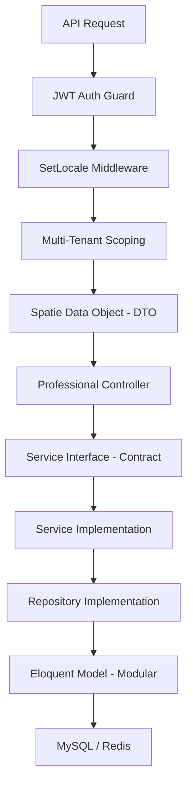

# Laravel Smart Dev Kit


[](https://github.com/MohammedTaha187/Laravel-Smart-Dev-Kit/actions)
[](https://laravel.com)
[](https://php.net)
[](https://en.wikipedia.org/wiki/Clean_architecture)
[](LICENSE)

A modular SaaS starter kit for Laravel. This project provides a production-ready ecosystem that focuses on separation of concerns, multi-tenancy, and automated feature generation.

---

## System Architecture

The project follows a modular, interface-driven approach to ensure the application remains scalable and easy to test.



### Key Features
- **Modular Framework**: Powered by `nwidart/laravel-modules`. Maintain clear boundaries between Ecommerce, CRM, and Billing domains.
- **Service Layer**: Strict separation of concerns using **Interfaces (Contracts)** for maximum testability and decoupling.
- **Type-Safe Data**: Unified validation and transformation using **Spatie Data Objects**.
- **Security**: Integrated **JWT** for high-performance mobile and web API authentication.
- **SaaS Ready**: Built-in **Multi-Tenancy** and **Localization** support.

---

## Feature Generation: Smart CRUD

The package includes a custom **`smart:crud`** command that automates the creation of all required files for a new feature.

### **The Power Command:**
```bash
./vendor/bin/sail artisan smart:crud Product \
  --api \
  --with-service \
  --with-data \
  --with-contracts \
  --translatable=name,description \
  --with-media \
  --module=Ecommerce
```

### Files Generated
Running the command with the flags below will generate the following components:
- **Model** & **Migration** (with Translatable & Tenant traits).
- **Controller** (Clean API logic).
- **Service** & **Repository** (Strict separation of concerns).
- **Service & Repository Interfaces** (Contracts for DI).
- **Spatie Data Object** (The Type-safe DTO).
- **Form Request** & **API Resource**.
- **Policy** (Security & Permissions).
- **Feature Test** (Ready-to-run Pest tests).

### ✨ Architectural Generation:
- **`--module=X`**: Nests files directly into a specific domain module.
- **`--with-data`**: Generates a type-safe Data Object for precise payload handling.
- **`--with-contracts`**: Automatically generates Interfaces and binds them in the Container.
- **`--translatable=fields`**: Injects multi-language support into the database and model.

---

## 🛠️ Step-by-Step Installation

## 🛠️ Step-by-Step Installation

### 1. **Clone & Install**:
   ```bash
   git clone https://github.com/MohammedTaha187/Laravel-Smart-Dev-Kit.git my-project && cd my-project
   composer install
   ```

### 2. Environment Configuration
Create your environment file and generate the necessary security keys.
```bash
cp .env.example .env
php artisan key:generate
php artisan jwt:secret
```

### 3. Launch with Docker (Laravel Sail)
This project is fully containerized. Start your environment and migrate the core tables.
```bash
./vendor/bin/sail up -d
./vendor/bin/sail artisan migrate --seed
```

---

### Building a Feature (Example: Products)

Generating a complete feature with the dev kit is a straightforward process using **Laravel Sail**:

### 1. Create Migration
Define your database schema as usual.
```bash
./vendor/bin/sail artisan make:migration create_products_table
```

### 2. Run Migration
```bash
./vendor/bin/sail artisan migrate
```

### 3. Generate Components
Generate the Controllers, Services, Repos, DTOs, and Modules for the feature.
```bash
./vendor/bin/sail artisan smart:crud Product \
  --api \
  --with-service \
  --with-data \
  --with-contracts \
  --translatable=name,description \
  --module=Inventory
```

---

## Core Principles
1. **Single Responsibility**: Logic is separated into Services, and data handling is managed by DTOs.
2. **Dependency Inversion**: Uses interface-driven design for better decoupling.
3. **Extensibility**: Built with traits and modular patterns for easy growth.

---

## License
Licensed under the [MIT license](https://opensource.org/licenses/MIT).
