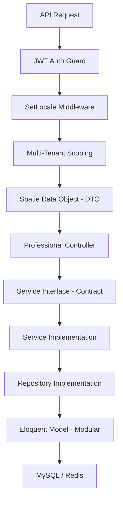

# 🏛️ Laravel Ultimate Modular SaaS Engine (L13+)


[](https://laravel.com)
[](https://php.net)
[](https://en.wikipedia.org/wiki/Clean_architecture)
[](LICENSE)

An enterprise-grade, API-first Laravel starter kit engineered for high-scale SaaS applications. This isn't just a boilerplate; it's a **Production-Ready Ecosystem** that enforces **SOLID principles**, **Clean Architecture**, and **Domain-Driven Design**.

---

## 💎 The "Ultimate" Architecture

This project implements the pinnacle of modern Laravel development patterns, ensuring your app is ready for global scale and massive data.



### 🚀 Key Professional Layers
- **Modular Framework**: Powered by `nwidart/laravel-modules`. Maintain clear boundaries between Ecommerce, CRM, and Billing domains.
- **Clean Service Layer**: Strict separation of concerns using **Interfaces (Contracts)** for maximum testability and decoupling.
- **Type-Safe Data Layer**: Unified validation and transformation using **Spatie Data Objects (DTOs)**.
- **Stateless Security**: Integrated **JWT (JSON Web Token)** for high-performance mobile and web API authentication.
- **Global SaaS Ready**: Pre-built **Multi-Tenancy** (Data isolation) and **Localization** (Support for 10+ languages per model).

---

## 🔥 Extreme Developer Velocity: Smart CRUD v2

The heart of this engine is a custom **`smart:crud`** command that handles all the heavy lifting, generating entire features in seconds.

### **The Power Command:**
```bash
php artisan smart:crud Product \
  --api \
  --with-service \
  --with-data \
  --with-contracts \
  --translatable=name,description \
  --with-media \
  --module=Ecommerce
```

### ✨ Architectural Generation:
- **`--module=X`**: Nests files directly into a specific domain module.
- **`--with-data`**: Generates a type-safe Data Object for precise payload handling.
- **`--with-contracts`**: Automatically generates Interfaces and binds them in the Container.
- **`--translatable=fields`**: Injects multi-language support into the database and model.

---

## 🛠️ Step-by-Step Installation

## 🛠️ Step-by-Step Installation

### 1. **Clone & Install**:
   ```bash
   git clone https://github.com/MohammedTaha187/Laravel-Smart-Dev-Kit.git my-project && cd my-project
   composer install
   ```

### 2. Environment Configuration
Create your environment file and generate the necessary security keys.
```bash
cp .env.example .env
php artisan key:generate
php artisan jwt:secret
```

### 3. Launch with Docker (Laravel Sail)
This project is fully containerized. Start your environment and migrate the core tables.
```bash
./vendor/bin/sail up -d
./vendor/bin/sail artisan migrate --seed
```

---

### 🚀 Building Your First Feature (Example: Products)

Building a complete CRUD with this engine is a 3-step process. Here is how you do it using **Laravel Sail**:

### 1. Create your Migration
Define your database schema as you usually do in Laravel.
```bash
./vendor/bin/sail artisan make:migration create_products_table
```

### 2. Run Migration
Apply your changes to the Docker database.
```bash
./vendor/bin/sail artisan migrate
```

### 3. Generate the "Ultimate" Architecture
Now, let the engine build the Controllers, Services, Repos, DTOs, and Modules for you.
```bash
./vendor/bin/sail artisan smart:crud Product \
  --api \
  --with-service \
  --with-data \
  --with-contracts \
  --translatable=name,description \
  --module=Inventory
```
*Wait 2 seconds... and your feature is 100% production-ready!* 🚀

---

## 🏛️ Project Principles (SOLID)
1. **Single Responsibility**: No FAT controllers. Logic lives in Services. Data lives in DTOs.
2. **Dependency Inversion**: We code to Abstractions, not Implementations.
3. **Open/Closed**: The Engine is built with Traits and Plugins, allowing you to add features without breaking the core.

---

## 🛡️ License
Licensed under the [MIT license](https://opensource.org/licenses/MIT). **Go build something legendary.** 🚀
