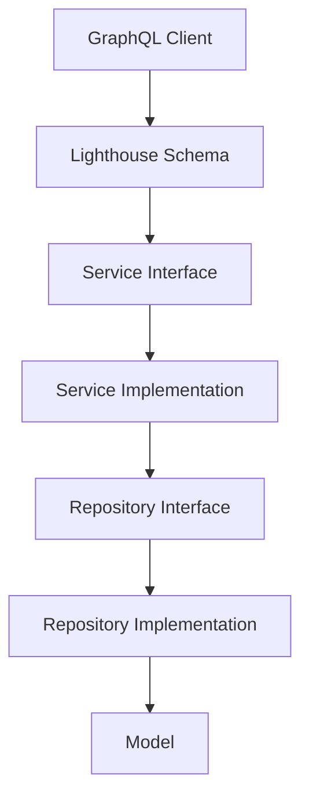

# 🚀 Laravel GraphQL Smart Dev Kit

[](https://packagist.org/packages/muhammad/easy-dev)
[](https://php.net)
[](https://laravel.com)
[](https://lighthouse-php.com)

**Laravel GraphQL Smart Dev Kit** is a professional, automation-focused toolkit designed to build high-performance GraphQL APIs. It eliminates boilerplate by generating Clean Architecture structures and GraphQL Schemas automatically.

---

## 🏗️ Architecture Flow

The SDK enforces a professional multi-layered architecture, perfectly integrated with **Nuwave Lighthouse**:



---

## 🚀 Key Features

- **Automated GraphQL Schema Generation**: Automatically generates `Types`, `Inputs`, `Queries`, and `Mutations` based on your database schema.
- **Clean Architecture CRUD**: Generate Model, Migration, DTO, Service, Repository, and Policy in one command.
- **Modular GraphQL Support**: Automatically creates and imports modular schema files (`Modules/{Module}/GraphQL/schema.graphql`).
- **Direct Lighthouse Integration**: Uses standard directives like `@find`, `@paginate`, `@create`, `@update`, and `@delete`.
- **Smart Type Mapping**: Automatically maps DB column types to GraphQL scalars (`String`, `Int`, `Float`, `Boolean`, `DateTime`).
- **Smart UUID Support**: Native support for UUID primary keys.

---

## 🛠️ Installation

```bash
# Clone the repository
git clone https://github.com/MohammedTaha187/Laravel-Smart-Dev-Kit-GraohQl.git

# Install dependencies
composer install

# Set up environment
cp .env.example .env
php artisan key:generate
php artisan jwt:secret

# Run migrations
php artisan migrate
```

---

## 📖 Usage

### 1. Generate a Professional GraphQL CRUD
Generate a complete feature set for a "Product" model:

```bash
php artisan smart:crud Product --module=Catalog
```

### 2. Testing via Postman
- **URL:** `http://localhost/graphql`
- **Method:** `POST`
- **Body:** `GraphQL`

Example Query:
```graphql
query {
  products {
    data {
      id
      name
      price
    }
  }
}
```

---

## 🧪 Testing

Every generated feature is ready for testing. Run:

```bash
php artisan test
```

---

## 👨‍💻 Author

**Muhammad Taha**  
*Backend Developer & Cloud Architect*

---
*Built with ❤️ for the Laravel & GraphQL Community.*
